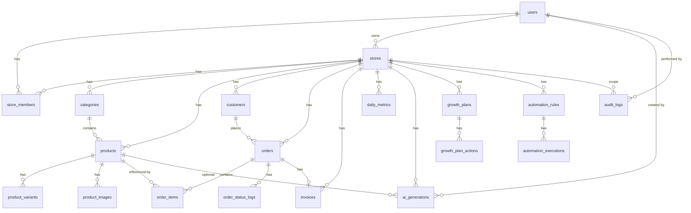

# Entity relationship overview

High-level view of how the main entities relate. For full column definitions see [schema.md](schema.md).

## Diagram (Mermaid)

## Grouped summary

- **Auth & tenants:** `users` → `stores` (owner), `store_members` (user–store–role), `store_invitations`.
- **Catalog:** `stores` → `categories`, `products` → `product_variants`, `product_images`; `tags` and `product_tags` for tagging.
- **Commerce:** `stores` → `customers`, `orders` → `order_items`, `order_status_logs`; `orders` → `invoices`.
- **Analytics:** `stores` → `daily_metrics` (one row per store per day).
- **AI:** `stores` → `ai_generations` (optional `product_id`, `created_by` user).
- **Growth:** `stores` → `growth_plans` → `growth_plan_actions`.
- **Automation:** `stores` → `automation_rules` → `automation_executions`.
- **Audit:** `audit_logs` reference `user_id`, `store_id`, and resource type/id.

All store-scoped tables have a `store_id` foreign key so that tenant isolation is enforced at the schema level.
